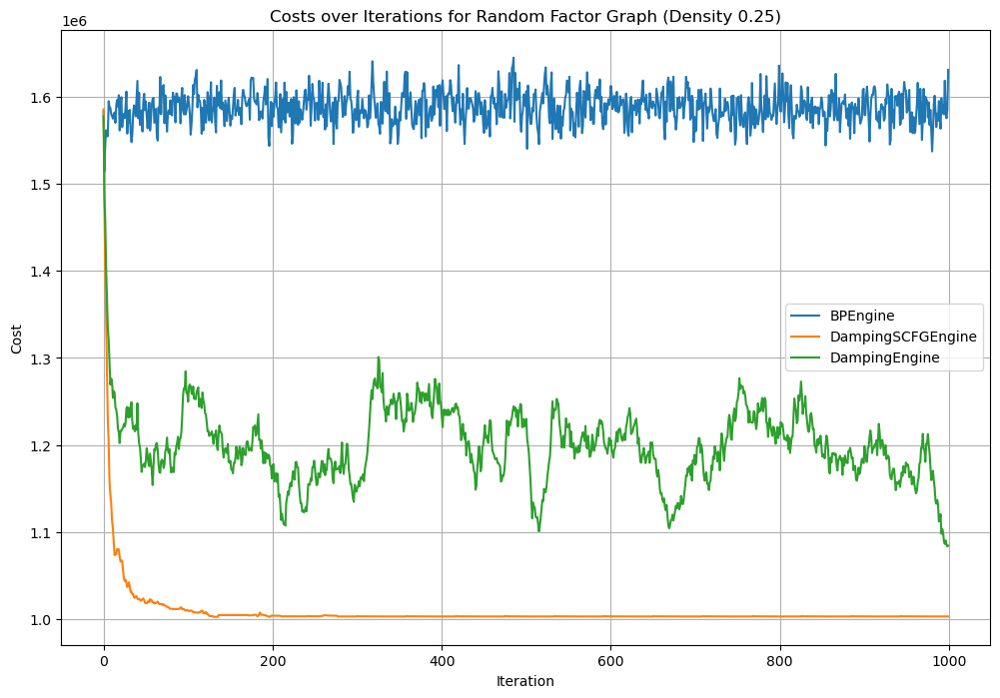

# Belief-Propagation-Simulator

## Overview
The **Belief-Propagation-Simulator** is a Python-based tool designed to simulate and analyze various belief propagation subproblems on factor graphs. It serves as a flexible framework for solving inference problems and can be extended to support a wide range of algorithms that operate on factor graphs.

## Key Features
- **Belief Propagation Subproblems**: Simulates a variety of subproblems within belief propagation.
- **Factor Graph Support**: Operates on factor graphs, with built-in tools for graph construction and configuration.
- **Extensible Framework**: Designed to support future extensions for algorithms that can run on factor graphs (e.g., DSA, other inference algorithms).
- **Graph State Persistence**: Save and load graph states efficiently using pickle files.
- **Debugging and Logging**: Integrated logging for debugging and monitoring.
### preliminary resaults:


>This project is a work in progress and is not yet fully functional. The current implementation focuses on the basic structure and functionality of the simulator, with plans for future enhancements and optimizations.
>
> it will be up and running very soon.
## Installation
To set up the project, clone the repository and install the required dependencies:
```bash
git clone https://github.com/OrMullerHahitti/Belief-Propagation-Simulator.git
cd Belief-Propagation-Simulator
pip install -r requirements.txt
